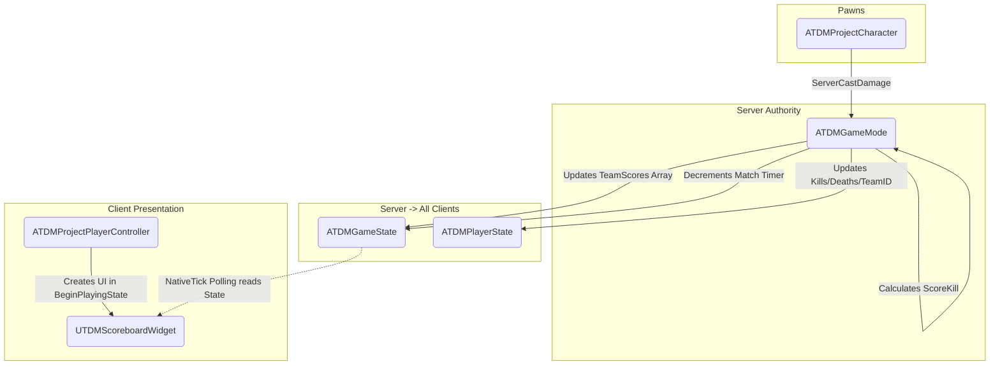

# Team Deathmatch Framework (Week 06)

## Overview
This project implements a server-authoritative Team Deathmatch (TDM) framework in Unreal Engine 5 using C++. It features a robust 4-player Listen Server architecture with fully replicated shared state (match timer, team scores) and per-player state (kills, deaths, team assignment). The UI is driven entirely by replicated data, ensuring perfect synchronization for all clients, including late joiners.

## Architecture Diagram

Below is the data and logic flow across the core gameplay framework classes:

### Logic Placement Justification
The core kill-handling logic (`ScoreKill`) is placed exclusively inside `ATDMGameMode`. This is an essential architectural decision for a multiplayer framework because the GameMode only exists on the Server. By keeping the score logic here, it is physically impossible for a malicious client to hack their own score, manipulate the match timer, or force the game to end prematurely. Furthermore, when a player dies, the server needs to safely access both the attacker's and the victim's `APlayerState` to increment kills and deaths. Handling this inside the GameMode ensures the server has undisputed authority to validate the friendly-fire checks, increment the global `TeamScores` array in the `AGameState`, and ultimately call `EndMatch()` when the score limit is reached.

### Features & Implementation Details
* **Late-Joiner Safety:** The UI utilizes an "Init on Construct" and polling pattern via `NativeTick` to completely eliminate network replication race conditions. Late-joining clients perfectly sync with the active match state.
* **Friendly Fire Prevention:** The `ServerCastDamage` implementation verifies Team IDs before applying damage.
* **Data-Driven UI:** The scoreboard dynamically allocates rows based on the GameState's `TeamScores` array, bypassing heavy RPC overhead.